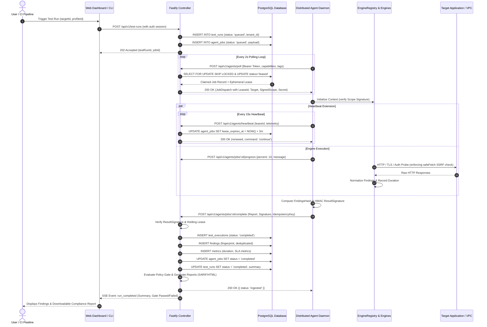

# Phase 16: Distributed Execution End-to-End Data Flow

```text
DOCUMENT: docs/architecture/phase-16-data-flow.md
STATUS: RATIFIED SPECIFICATION
PHASE: Phase 16 — Distributed Agent Trust Boundary & Secure Execution Plane
REVISION: 1.0.0
```

---

## 1. Executive Summary

This document traces the complete, end-to-end data flow for distributed test execution in Security Lab. It diagrams how test requests originate, how targets and scopes are bound, how jobs are dispatched, how remote agents execute probes locally, and how evidence and findings are normalized, signed, and ingested into the centralized database.

---

## 2. End-to-End Execution Flow (Mermaid Sequence)



---

## 3. Data Transformations Across Boundaries

### 3.1 Controller Job Enqueueing Transformation
When a test run is dispatched to the distributed queue, the controller assembles the `AgentJobDispatch` payload:

```text
Database Entities (targets, projects, test_runs)
   │
   ▼ Extract and Sanitize
1. Resolve target baseUrl and TargetScope.
2. Filter custom headers (strip internal controller tokens; inject authorized test headers).
3. Compute ScopeSignature: HMAC-SHA256(MasterKey, targetId + baseUrl + JSON(scope)).
4. Compute JobDispatchSecret: HMAC-SHA256(MasterKey, jobId + leaseId + agentId).
   │
   ▼ Package into AgentJobDispatch DTO
{
  jobId: "UUID",
  leaseId: "UUID",
  testRunId: "UUID",
  tenantId: "UUID",
  target: { id, name, baseUrl, scope, scopeSignature },
  engineIds: ["engine-native-headers", "engine-zap"],
  options: { ... },
  jobDispatchSecret: "HMAC_SECRET"
}
```

### 3.2 Agent Worker Execution & Normalization Transformation
Inside the customer VPC:

```text
AgentJobDispatch
   │
   ├─▶ 1. Scope Verification: Assert HMAC(target.scope) == target.scopeSignature
   ├─▶ 2. Execution Context Assembly: Inject correlationId, AbortController
   ├─▶ 3. Engine Dispatch Loop:
   │       ├─ Native Engine (Class A): safeFetch(url) with redirect re-validation
   │       └─ Container Engine (Class B/C): DockerRunner with dropped caps & scratch volume
   │
   ▼ Raw Engine Output
   │
   ├─▶ Raw Findings (title, severity, description, evidenceData)
   ├─▶ Quantitative Metrics (durations, p95 latencies, error counts)
   └─▶ Execution Summaries (engineId, status, durationMs, error)
   │
   ▼ Result Sealing
   FindingsHash = SHA-256(CanonicalJSON(findings) + CanonicalJSON(executions))
   ResultSignature = HMAC-SHA256(JobDispatchSecret, jobId + FindingsHash)
```

### 3.3 Controller Ingestion Transformation
When `/jobs/:id/complete` receives the payload:

```text
AgentJobCompletionReport
   │
   ├─▶ 1. Validate Lease: DB.agent_jobs.lease_id == report.leaseId && NOW() < lease_expires_at
   ├─▶ 2. Validate Tenant & Agent: DB.agent_jobs.tenant_id == agent.tenant_id
   ├─▶ 3. Verify Signature: Recalculate HMAC and assert exact match
   ├─▶ 4. Deduplication Check: If job.status == 'completed', return 200 OK immediately
   │
   ▼ Transform to Core Relational Entities
   │
   ├─▶ INSERT test_executions (one row per reported engine)
   ├─▶ For each finding:
   │     ├─ computeHardenedFindingFingerprint(targetId, engineId, ruleId, location)
   │     ├─ Ingest into findings table with tenant isolation
   │     └─ If evidence present: compute canonical SHA-256 hash, insert evidence_records
   ├─▶ For each metric: insert into metrics table
   ├─▶ Reconcile finding lifecycle (mark resolved/regressed)
   ├─▶ Evaluate enterprise release policy (PolicyEngine.evaluate)
   └─▶ Persist SARIF v2.1.0, JUnit XML, and HTML compliance artifacts
```

---

## 4. Secret Scrubbing & Data Hygiene at Each Hop

| Hop | Data Transmitted | Secret Scrubbing Rules |
| :--- | :--- | :--- |
| **Controller ➔ DB** | Job Payloads | Sensitive test credentials must be stored in encrypted format or referenced by credential ID; never stored in plaintext JSON. |
| **Controller ➔ Agent** | Job Dispatch | Passwords and API tokens are transmitted only over TLS 1.3. Internal controller secrets are never included. |
| **Agent Logs** | Progress & Debug Messages | Pino logger redact rules strictly mask `Authorization`, `X-Api-Key`, `Cookie`, `Set-Cookie`, `token`, `secret`. |
| **Agent ➔ Controller** | Findings & Evidence | Authorization headers captured during testing are truncated or masked (`Bearer agt_sec_...***`) before transmission. |
| **Controller ➔ UI / Reports** | SARIF / HTML Reports | Full request/response bodies sanitized to remove bearer tokens from reproduction `curl` commands. |

---

## 5. Execution Topology Comparison

```text
LOCAL-FIRST WORKSTATION MODE
============================
User ──▶ CLI / Controller ──▶ In-Process Engines / Local Docker ──▶ Localhost Target
(Zero network calls outside machine; single-tenant database; instant execution)

PRIVATE AGENT HYBRID MODE
=========================
User ──▶ Central Controller (SaaS/On-Prem) 
                 ▲
                 │ (Outbound HTTPS Poll / Heartbeat)
         Customer Private Agent (VPC) ──▶ Internal Targets (10.0.0.0/8)
(No inbound firewall holes; target traffic never leaves customer VPC)

FUTURE MULTI-REGION SAAS MODE
=============================
Global Web Control Plane ──▶ Regional Agent Pools (AWS / GCP / Azure) ──▶ Public APIs
                                     ▲
                                     │ (mTLS Tunnel)
                             Private VPC Agents ──▶ On-Premise Core Banking APIs
```
