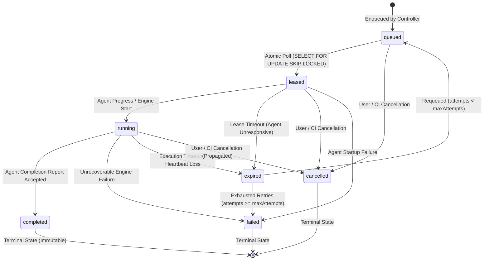

# Phase 16: Distributed Job State Machine & Lease Management

```text
DOCUMENT: docs/architecture/phase-16-job-state-machine.md
STATUS: RATIFIED SPECIFICATION
PHASE: Phase 16 — Distributed Agent Trust Boundary & Secure Execution Plane
REVISION: 1.0.0
```

---

## 1. Executive Summary

In a distributed testing system, execution workers operate asynchronously over unreliable networks. Agents can crash, reboot, lose network connectivity, suffer power loss, or hang inside container processes.

The **Job State Machine** guarantees:
1. **At-Most-Once Execution Per Lease**: No two agents can claim or execute the same job simultaneously.
2. **Deterministic State Transitions**: Every state transition is atomic and enforced by database constraints.
3. **Bounded Retries with Dead-Letter Handling**: Orphaned or failed jobs are automatically requeued up to a strict retry cap (`maxAttempts = 3`).
4. **Idempotent Terminal States**: Terminal states (`completed`, `cancelled`, `failed`) are immutable. Stale or duplicate completions are safely deduplicated.

---

## 2. Job State Model & Mermaid Diagram



---

## 3. Comprehensive State Definitions & Invariants

| State | Meaning | Database Attributes | Permitted Next States |
| :--- | :--- | :--- | :--- |
| **`queued`** | Job is waiting in the queue to be picked up by an authorized agent. | `agent_id = NULL`, `lease_id = NULL`, `status = 'queued'` | `leased`, `cancelled` |
| **`leased`** | Agent claimed job during polling. Active lease timer running. | `agent_id = <UUID>`, `lease_id = <UUID>`, `lease_expires_at = NOW() + 5m` | `running`, `expired`, `cancelled`, `failed` |
| **`running`** | Agent has initialized engines and is transmitting progress updates. | `status = 'running'`, `updated_at = NOW()`, `started_at = NOW()` | `completed`, `failed`, `expired`, `cancelled` |
| **`completed`** | Execution finished successfully; findings and metrics ingested. | `status = 'completed'`, `completed_at = NOW()`, `result = <JSON>` | **TERMINAL (Immutable)** |
| **`failed`** | All attempts exhausted or non-recoverable error encountered. | `status = 'failed'`, `completed_at = NOW()`, `error = <TEXT>` | **TERMINAL (Immutable)** |
| **`cancelled`** | User or CI pipeline aborted the test run. | `status = 'cancelled'`, `completed_at = NOW()`, `error = 'Aborted by user'`| **TERMINAL (Immutable)** |
| **`expired`** | Lease elapsed without heartbeat extension or completion. | `status = 'expired'`, `lease_id = NULL` | `queued` (requeue) or `failed` |

---

## 4. Atomic Claiming & Concurrency Controls

### 4.1 The Race Condition in Naive Polling
When two agents execute:
```sql
-- VULNERABLE NON-ATOMIC PATTERN
SELECT * FROM agent_jobs WHERE status = 'queued' LIMIT 1;
-- Both Agent 1 and Agent 2 get Job 101!
UPDATE agent_jobs SET status = 'leased', agent_id = ... WHERE id = 101;
```
Both agents believe they own the job.

### 4.2 The Atomic Lease Claim Pattern
To prevent double-leasing, the controller executes an atomic claim query utilizing PostgreSQL row-level locks:

```sql
WITH claimable AS (
  SELECT id
  FROM agent_jobs
  WHERE tenant_id = $1
    AND status = 'queued'
    AND attempts < max_attempts
    AND (required_tags <@ $2::jsonb OR required_tags = '[]'::jsonb)
    AND (required_capabilities <@ $3::jsonb OR required_capabilities = '[]'::jsonb)
  ORDER BY created_at ASC
  LIMIT $4
  FOR UPDATE SKIP LOCKED
)
UPDATE agent_jobs
SET status = 'leased',
    agent_id = $5,
    lease_id = gen_random_uuid(),
    lease_expires_at = NOW() + INTERVAL '5 minutes',
    dispatched_at = NOW(),
    attempts = attempts + 1,
    updated_at = NOW()
FROM claimable
WHERE agent_jobs.id = claimable.id
RETURNING agent_jobs.*;
```

**Guarantees**:
1. `FOR UPDATE SKIP LOCKED` guarantees that if Agent 1 locks a row, Agent 2 automatically skips it and locks the next available job without blocking.
2. In single-tenant SQLite mode (CLI/local), the database is serialized via write transactions (`BEGIN IMMEDIATE`).

---

## 5. Lease Lifecycles & Watchdog Reaper

### 5.1 Lease Timing Parameters
- **Initial Lease Duration**: `5 minutes` (allows container image downloads and initialization).
- **Heartbeat Interval**: `10–30 seconds`.
- **Lease Renewal on Heartbeat**: Every time the agent reports a heartbeat referencing an active `leaseId`, the controller extends `lease_expires_at = NOW() + INTERVAL '3 minutes'`.
- **Maximum Absolute Execution Cap**: `30 minutes` (regardless of renewals, preventing zombie tasks from monopolizing workers).

### 5.2 The Watchdog Reaper Service (`AgentJobReaper`)
A lightweight background loop runs in `@security-lab/controller` every 30 seconds:

```ts
export async function reapExpiredJobLeases(db: DatabaseInstance): Promise<number> {
  // 1. Identify jobs whose lease expired while in 'leased' or 'running'
  const expiredJobs = await db
    .select()
    .from(agentJobs)
    .where(
      and(
        inArray(agentJobs.status, ['leased', 'running']),
        lt(agentJobs.leaseExpiresAt, new Date()),
      ),
    );

  let reapedCount = 0;
  for (const job of expiredJobs) {
    if (job.attempts < job.maxAttempts) {
      // Requeue job for another attempt
      await db
        .update(agentJobs)
        .set({
          status: 'queued',
          agentId: null,
          leaseId: null,
          leaseExpiresAt: null,
          updatedAt: new Date(),
        })
        .where(eq(agentJobs.id, job.id));

      logger.warn(
        { jobId: job.id, attempt: job.attempts, maxAttempts: job.maxAttempts },
        'Job lease expired; requeued for next available agent',
      );
    } else {
      // Exhausted retries: mark permanently failed
      await db
        .update(agentJobs)
        .set({
          status: 'failed',
          error: `Execution timed out and exceeded maximum retries (${job.maxAttempts})`,
          completedAt: new Date(),
          updatedAt: new Date(),
        })
        .where(eq(agentJobs.id, job.id));

      // Mark parent test run failed
      await testRunsService.updateTestRunStatus(job.testRunId, 'failed');
    }
    reapedCount++;
  }
  return reapedCount;
}
```

---

## 6. Cancellation Architecture & Race Condition Handling

### 6.1 Cancellation Path
1. **User requests cancellation**: User clicks "Cancel" in Dashboard or executes `security-lab test cancel <ID>`.
2. **Controller records cancellation**: `agent_jobs.status` is set to `'cancelled'`. `test_runs.status` is set to `'cancelled'`.
3. **Signal propagation**:
   - In-memory runs: AbortSignal triggered immediately.
   - Remote agent runs: The next agent heartbeat response carries `cancelledJobIds: ["<JOB_ID>"]`.
4. **Agent-side termination**: The agent daemon locates the active `AbortController` for that `jobId` and triggers `abort()`. Child processes and Docker containers (`DockerRunner.cleanupContainer`) are stopped within 2 seconds.
5. **Agent acknowledgement**: Agent transmits cancellation ack to controller.

### 6.2 Late Completion After Cancellation / Expiration
If an agent finishes work and attempts to submit results *after* a job has already been marked `'cancelled'` or `'expired'`:

```ts
if (job.status === 'cancelled') {
  logger.info({ jobId }, 'Rejecting completion report: job was cancelled by user');
  return { success: true, action: 'ignored', status: 'cancelled' };
}

if (job.status === 'completed') {
  logger.info({ jobId }, 'Deduplicating completion report: job is already completed');
  return { success: true, action: 'deduplicated', status: 'completed' };
}

if (job.leaseId !== report.leaseId || new Date() > job.leaseExpiresAt) {
  throw new LeaseExpiredError('Cannot accept completion: lease has expired');
}
```

**Guarantees**:
- A late completion will **never** resurrect a cancelled test run.
- A duplicate submission will **never** re-insert findings or duplicate metrics.
- Stale workers whose leases were reaped cannot corrupt the database.

### 6.3 Cancellation Acknowledgment Protocol
To prevent continuous transmission of `cancelledJobIds` over heartbeat responses once an agent has handled cancellation:
1. When the agent daemon receives `cancelledJobIds` in a heartbeat response:
   - It triggers `abortController.abort()` for the matching active in-flight job.
   - It fires an immediate acknowledgment: `POST /api/v1/agents/jobs/:jobId/cancel-ack`.
2. The controller updates the job's `result` column to include `{ cancelledAck: true, acknowledgedAt: "..." }`.
3. Subsequent heartbeat queries filter out acknowledged jobs (`WHERE (result IS NULL OR result->>'cancelledAck' IS NULL)`), pruning the heartbeat payload.
4. If an agent calls `/complete` or `/fail` for a job already marked `'cancelled'`, the controller returns `200 OK` with `{ status: 'cancelled', ignored: true }` without updating findings, metrics, or test run status.

### 6.4 Hard Execution Timeouts & Worker Self-Abort
To prevent runaway execution loops and resource starvation on agents:
1. Every dispatched job includes `target.scope.limits.maxDuration` (parsed as e.g. `'10m'`, `'15m'`, `'30s'`), defaulting to 15 minutes.
2. The `AgentWorker` wraps job execution with a timer:
   - If `maxDuration` is reached before execution completes, a `JobTimeoutError` is raised.
   - An internal timeout abort signal fires, breaking all engine execution loops and initiating container teardown.
   - The worker reports failure to the controller with `error: "Job execution exceeded maximum duration timeout: ..."` and `job.timeout_exceeded` is logged.

### 6.5 API Rate Limiting & Resource Governance
Agent-facing controller endpoints are guarded by `@fastify/rate-limit` and payload body limits to prevent resource exhaustion:
- `POST /api/v1/agents/heartbeat`: Max 120 requests/minute per agent (keyed by agent ID).
- `POST /api/v1/agents/poll`: Max 60 requests/minute per agent (keyed by agent ID).
- `POST /api/v1/agents/jobs/:jobId/complete`: Max body size of 5MB (`bodyLimit: 5242880`), preventing memory exhaustion during massive finding submissions.
- Excessive requests receive `429 Too Many Requests` with `Retry-After` headers. Payloads exceeding 5MB are rejected with `413 Payload Too Large`.
