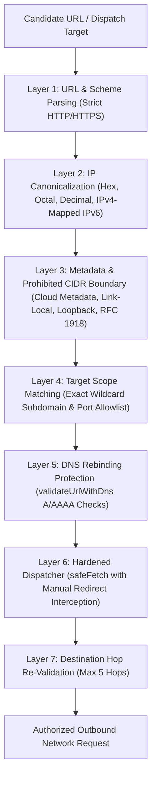
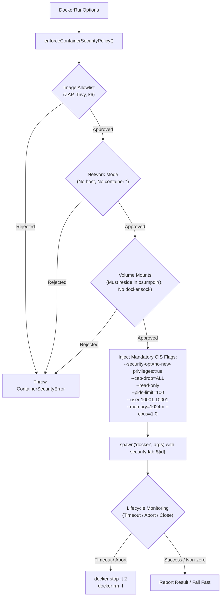

# Security Boundaries & Defensive Controls

## 1. Operating Principle

Security Lab is designed exclusively for authorized testing of enterprise systems owned or operated under explicit legal authority. To enforce this principle, the architecture implements a multi-layer defense-in-depth model that places deterministic security gates between user input, orchestration pipelines, and raw network dispatch.

---

## 2. Multi-Layer Defense-in-Depth Architecture

---

## 3. Defense Layers & Implementation Details

### Layer 1: Strict Protocol & Scheme Validation
* Permitted schemes: strictly `http:` and `https:`.
* All unsafe protocol handlers (`file://`, `ftp://`, `gopher://`, `javascript:`, `data:`) are rejected before any network socket is opened.

### Layer 2: Alternative IP Canonicalization
Attackers frequently disguise loopback or cloud metadata addresses using non-standard IP formats. The IP utility in `@security-lab/domain` canonicalizes all variations into standard formats:
* **Decimal integer**: e.g. `http://2852039166/` canonicalizes to `169.254.169.254`; `http://2130706433/` to `127.0.0.1`.
* **Hexadecimal**: e.g. `http://0xa9fea9fe/` canonicalizes to `169.254.169.254`; `http://0x7f000001/` to `127.0.0.1`.
* **Dotted octal**: e.g. `http://0251.0376.0251.0376/` canonicalizes to `169.254.169.254`; `http://0177.0.0.1/` to `127.0.0.1`.
* **IPv4-mapped IPv6**: e.g. `http://[::ffff:169.254.169.254]/` or `http://[::ffff:a9fe:a9fe]/` extracts the underlying IPv4 address and verifies both.
* **IPv4-compatible IPv6**: e.g. `http://[::169.254.169.254]/` is normalized and inspected.

### Layer 3: Unconditional Cloud Metadata & Prohibited CIDR Shielding
* **Cloud Metadata**: Access to `169.254.169.254`, `fd00:ec2::254` (AWS IPv6 IMDS), `100.100.100.200` (Alibaba), and hostnames (`metadata.google.internal`, `metadata.local`, `instance-data`) is **unconditionally prohibited** regardless of target scope configuration.
* **Link-Local**: `169.254.0.0/16` and `fe80::/10` are blocked.
* **Loopback**: `127.0.0.0/8`, `::1/128`, `0.0.0.0/8`, and `::/128` are prohibited unless explicitly enumerated in `target.scope.allowedHosts` (e.g. for local developer workstation tests).
* **Private RFC 1918 & ULA**: `10.0.0.0/8`, `172.16.0.0/12`, `192.168.0.0/16`, `100.64.0.0/10` (CGNAT), and `fc00::/7` are prohibited unless explicitly permitted by target scope (`allowPrivateIps: true` or explicitly listed in `allowedHosts`).
* **Multicast and Broadcast**: `224.0.0.0/4`, `240.0.0.0/4`, `255.255.255.255/32`, and `ff00::/8` are unconditionally blocked.

### Layer 4: Precise Host & Subdomain Boundary Enforcement
* **Exact Subdomain Wildcard**: For an allowed host `*.example.com`:
  * Matches: `api.example.com`, `v1.api.example.com`, `auth.example.com`.
  * **Rejects**: `evil-example.com` (suffix confusion attack), `example.com.attacker.com` (TLD append attack), `example.com` (root domain unless explicitly enumerated).
* **Allowed Ports**: Only ports specified in `scope.allowedPorts` (e.g. `[80, 443]`) are permitted. Outbound calls to internal database ports (e.g. `5432`, `6379`, `27017`) are blocked.
* **Excluded Paths**: Outbound requests matching `scope.excludedPaths` (e.g. `/admin/reset-db`, `/billing/keys`) are aborted.

### Layer 5: Asynchronous DNS Resolution & Rebinding Protection
To prevent DNS rebinding attacks where an authorized hostname dynamically resolves to an internal IP address:
* `validateUrlWithDns(candidateUrl, scope)` resolves candidate hostnames via `node:dns/promises`.
* Inspects both `A` and `AAAA` records returned by the resolver.
* Rejects any domain if any resolved IP falls into prohibited ranges (metadata, loopback, unlisted private subnets).

### Layer 6: Hardened safeFetch & Hop-by-Hop Redirect Interception
All native testing engines (`headers`, `cors`, `tls`, `declarative`, `rate-limit`, `k6`) dispatch HTTP traffic exclusively through `safeFetch`:
* **Redirect Configuration**: Enforces `redirect: 'manual'` so the Node.js runtime never automatically follows HTTP 3xx redirects.
* **Interception**: Catches 301, 302, 303, 307, and 308 redirect responses.
* **Hop Re-Validation**: Extracts the destination `Location` header, resolves relative paths, and re-validates the destination URL strictly against `validateUrlAgainstScope`.
* **Termination on Abuse**: If a target attempts to redirect to a private IP, loopback, cloud metadata, or unauthorized host/port, execution terminates immediately with a `SecurityBoundaryError`.
* **Max Redirect Chain**: Limits redirect chains to a maximum of 5 hops to prevent denial-of-service redirect loops.

### Layer 7: Declarative DSL Absolute URL Containment
* In `DeclarativeTestEngine`, if a test specification contains an absolute URL in `testSpec.path` (`http://...` or `https://...`), the engine runs `validateUrlAgainstScope(path, context.target.scope)` before transmission.
* Out-of-scope absolute URLs are rejected immediately with a Critical finding (`Security Boundary Violation`), incrementing assertion failure counters without dispatching any network traffic.

---

## 4. Container Sandboxing & Least Privilege (Class B / Class C)

External container scanners (OWASP ZAP, Aqua Trivy) and heavy load workers (Grafana k6) run in ephemeral, hardened Docker containers governed by the `DockerRunner` kernel and `docker-policy.ts`. Pre-flight validation occurs in TypeScript before any child process is spawned.

### Mandatory CIS Docker Benchmark Flags
Every container spawned by `DockerRunner` is injected with the following mandatory security flags:
* `--security-opt=no-new-privileges:true`: Prevents processes inside the container from gaining additional privileges via `setuid` or `setgid` binaries.
* `--cap-drop=ALL`: Drops all Linux kernel capabilities (including `CAP_NET_RAW`, `CAP_SYS_ADMIN`, `CAP_DAC_OVERRIDE`), restricting the container to unprivileged system calls.
* `--read-only`: Mounts the container root filesystem as read-only. Temporary writes require explicit volume mounts.
* `--pids-limit=100`: Enforces PID exhaustion limits to prevent fork bombs from impacting the host.
* `--memory="1024m"` and `--cpus="1.0"`: Enforces strict cgroup CPU and memory limits to prevent denial of service.
* `--user=10001:10001`: Forces execution under an unprivileged non-root user and group UID/GID.

### Volume Mount Allowlist & Ephemeral Scratch Directories
To eliminate host filesystem exposure and Docker socket takeover:
1. **Forbidden Paths**: Mounting `/var/run/docker.sock`, `/var/run`, `/etc`, `/root`, `/bin`, `/sbin`, `/usr`, `/proc`, `/sys`, `C:\Windows`, root paths (`/`, `C:\`), and the project workspace directory is unconditionally forbidden.
2. **Path Sanitization**: All host paths are canonicalized via `path.resolve` and checked for path traversal (`..`) attempts.
3. **Dedicated Ephemeral Scratch Directories**: Volume mounts are restricted strictly to temporary scratch directories provisioned via `createScratchDirectory()` under `os.tmpdir()` with restrictive directory permissions (`0700`). Containers write reports solely into this ephemeral scratch directory and clean up via `scratch.destroy()` upon test completion.

### Approved Image Allowlist
Arbitrary Docker images (e.g. `ubuntu`, `alpine`, `node`, `attacker-registry.com/...`) are rejected pre-flight. Only verified container images from trusted registries are permitted:
* **OWASP ZAP**: `^(ghcr\.io/zaproxy/zaproxy|zaproxy/zaproxy|owasp/zap2docker-weekly|owasp/zap2docker-stable)(:[a-zA-Z0-9_.-]+)?$`
* **Aqua Trivy**: `^(docker\.io/aquasec/trivy|aquasec/trivy|ghcr\.io/aquasecurity/trivy)(:[a-zA-Z0-9_.-]+)?$`
* **Grafana k6**: `^(docker\.io/grafana/k6|grafana/k6|loadimpact/k6)(:[a-zA-Z0-9_.-]+)?$`

### Network Mode Isolation
* `--network host` is strictly forbidden to prevent containers from binding directly to host interfaces or intercepting host loopback traffic.
* `--network container:*` is forbidden to prevent container namespace hijacking.
* Containers default to an isolated, unprivileged Docker bridge network.

### Deterministic Lifecycle & Cleanup
* Each container execution is assigned a unique, trackable identifier: `security-lab-${executionId}`.
* On execution timeout (`options.timeoutMs`) or cancellation (`options.abortSignal`), `DockerRunner` terminates the container gracefully with `docker stop -t 2 security-lab-${id}` followed by deterministic removal `docker rm -f security-lab-${id}`, eliminating orphaned containers.

### Elimination of Silent Mock Fallbacks
* Silent mock fallbacks have been completely removed from production execution paths.
* When Docker is uninstalled, daemon is unreachable, or a container exits with an execution failure, `DockerRunner` fails fast and returns an explicit, descriptive error.
* Simulated / mock execution is strictly opt-in and will only execute if explicitly requested via `options.simulated === true` or configured in the environment via `SECURITY_LAB_MOCK_CONTAINERS === 'true'`.

