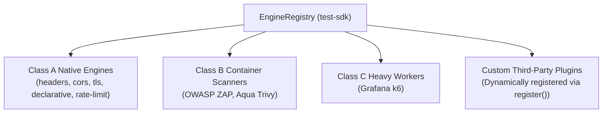
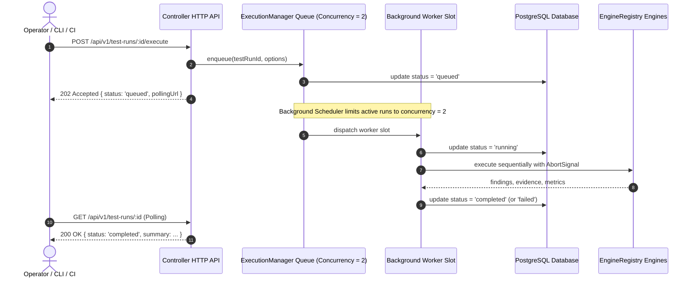

# Test Engine Architecture & Execution Classes

## 1. Architectural Strategy

Security testing tools vary drastically in runtime requirements, resource footprint, language runtimes, memory consumption, and potential side-effects.

To prevent the controller from degrading, crashing, or suffering security compromises from third-party tools, Security Lab separates test execution into **three distinct execution classes**.

---

## 2. The Three Execution Classes

| Execution Class | Description | Examples | Execution Model | Resource Footprint |
| :--- | :--- | :--- | :--- | :--- |
| **Class A: Native** | In-process native TypeScript assertions | HTTP headers, TLS handshakes, CORS policies, Cookie flags, Authentication tokens, Baseline rate-limits | In-process asynchronous event loop worker | Negligible (< 50MB RAM, < 1s latency) |
| **Class B: Scanner Container** | External third-party vulnerability scanners | OWASP ZAP, Aqua Trivy, Checkov | Ephemeral, isolated Docker runner container | Moderate (500MB - 2GB RAM, 1 - 5 mins) |
| **Class C: Heavy Worker** | Heavy concurrency and resilience tools | Grafana k6, Playwright browser suites, Chaos experiments | Ephemeral container with pinned CPU/RAM limits | Heavy (1GB - 4GB+ RAM, multi-core CPU) |

---

## 3. Rationale for Separation

### 3.1 Process Isolation & Stability
External tools like OWASP ZAP are large Java applications with dynamic heap requirements and multi-threaded scanners. Running them in the same process as the Fastify controller would risk out-of-memory (OOM) crashes, blocking the controller event loop, and bringing down the management plane.

### 3.2 Security Sandboxing & Least Privilege
Scanner tools often ingest untrusted payloads, parse complex HTML/JavaScript, or generate unexpected network traffic. By running them in isolated Docker containers:
* Containers have no access to the host filesystem.
* Containers run with unprivileged user accounts (`nobody` or non-root `appuser`).
* Container network access is restricted to the target network or bridge.

### 3.3 Independent Tool Versioning & Replaceability
Separating engines behind the `TestEngine` contract (`@security-lab/test-sdk`) ensures the platform never couples to a specific tool version or vendor API.
* An organization can swap ZAP for an alternative scanner without modifying controller logic or database models.
* Findings from all engines are normalized into the platform's unified `Finding` domain model.

### 3.4 Scalability and Multi-Tenancy Readiness
Class C workers (such as k6 load generators) require significant CPU cores to generate thousands of concurrent requests. By decoupling their execution into worker containers, they can be dispatched across distributed agents or worker pools in future enterprise/cloud editions without altering the core controller contract.

---

## 4. The Unified TestEngine Contract

Regardless of whether an engine is Class A, B, or C, it must implement the fundamental interface defined in `@security-lab/test-sdk`:

```typescript
export type EngineExecutionClass = 'class_a_native' | 'class_b_container' | 'class_c_worker';

export interface TestEngine {
  readonly id: string;
  readonly version: string;
  readonly executionClass?: EngineExecutionClass;

  capabilities(): TestCapability[];

  validate(input: TestInput): ValidationResult;

  execute(
    input: TestInput,
    context: ExecutionContext
  ): Promise<TestResult>;

  /** Optional lifecycle hooks */
  init?(): Promise<void>;
  healthCheck?(): Promise<boolean>;
  cleanup?(): Promise<void>;
}
```

The controller interacts **only** with this abstraction, maintaining architectural purity.

---

## 5. Dynamic EngineRegistry

The `EngineRegistry` in `@security-lab/test-sdk` replaces hardcoded engine arrays with a pluggable, queryable engine repository:



### Registry API
- `register(engine, metadata?)`: Registers an engine instance with execution class metadata.
- `unregister(engineId)`: Unregisters an engine.
- `get(engineId)`: Retrieves an engine instance by ID.
- `getAll()`: Returns all registered engines.
- `findByCapability(capabilityId)`: Finds engines providing a specific capability (e.g. `'headers_audit'`).
- `findByCategory(category)`: Finds engines under a capability category (e.g. `'passive_analysis'`).
- `findByExecutionClass(class)`: Queries engines by `'class_a_native'`, `'class_b_container'`, or `'class_c_worker'`.
- `listCapabilities()`: Discovers all registered testing capabilities.
- Lifecycle management: `initAll()`, `healthCheckAll()`, `cleanupAll()`.

---

## 6. Decoupled Asynchronous Execution Queue

To prevent long-running test executions (such as ZAP, Trivy, or k6) from blocking the Fastify HTTP event loop or connection timeouts, test dispatch is completely decoupled from HTTP response generation via `ExecutionManager`.



### Key Execution Properties
1. **HTTP Decoupling**: `POST /api/v1/test-runs/:id/execute` returns `202 Accepted` immediately with the run status and a polling URL.
2. **Worker Concurrency Limit**: Capped at `concurrency = 2` by default to prevent overloading local development workstations.
3. **Synchronous Compatibility**: Passing `?wait=true` or `{ wait: true }` instructs `ExecutionManager` to block and await completion, returning HTTP 200 `{ testRun, executions, findings }` for backward compatibility with CLI workflows and targeted test suites.

---

## 7. Centralized Cancellation & Deterministic Teardown

`ExecutionManager` maintains a centralized map of active test runs and their corresponding `AbortController` instances:

1. **Cancellation API**: `POST /api/v1/test-runs/:id/cancel` and CLI command `security-lab test cancel <testRunId>`.
2. **Signal Propagation**: Calling `cancel()` invokes `abortController.abort()`. The `AbortSignal` propagates through `ExecutionContext` to:
   - In-flight native HTTP requests via `safeFetch`.
   - External container processes via `DockerRunner`, which immediately executes `docker stop -t 2 <name>` followed by `docker rm -f <name>`.
   - Remaining queued engines in the test profile, which are skipped.
3. **State Transition**: The test run and any active test executions are set to `status = 'cancelled'` in the database in under 2 seconds.
4. **Guard Rails**: Attempting to cancel an already completed, failed, or non-existent test run fails fast with an appropriate HTTP 400 or 404 response.

